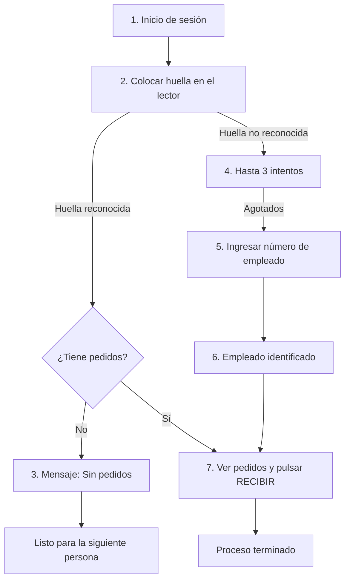
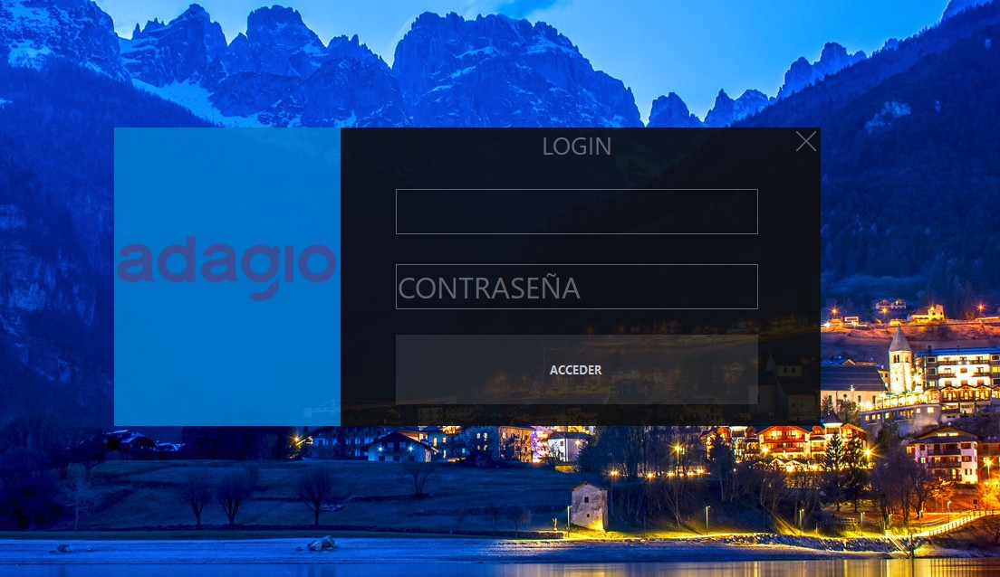
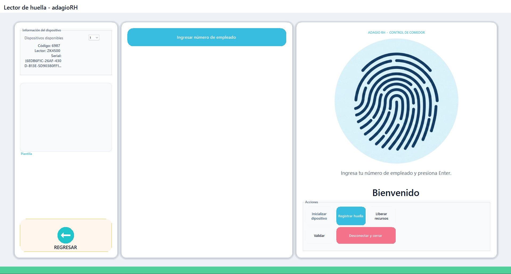
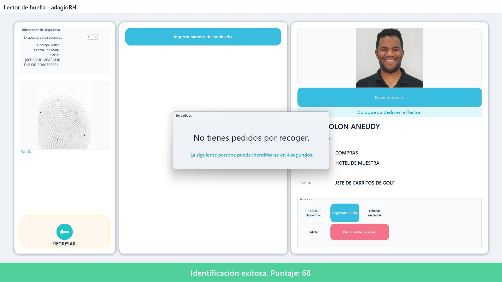
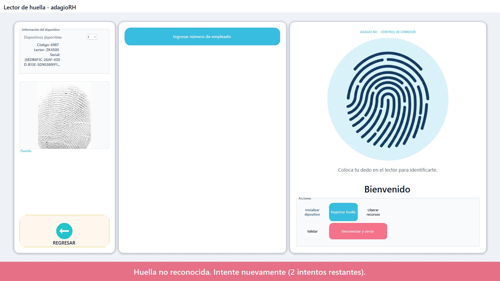
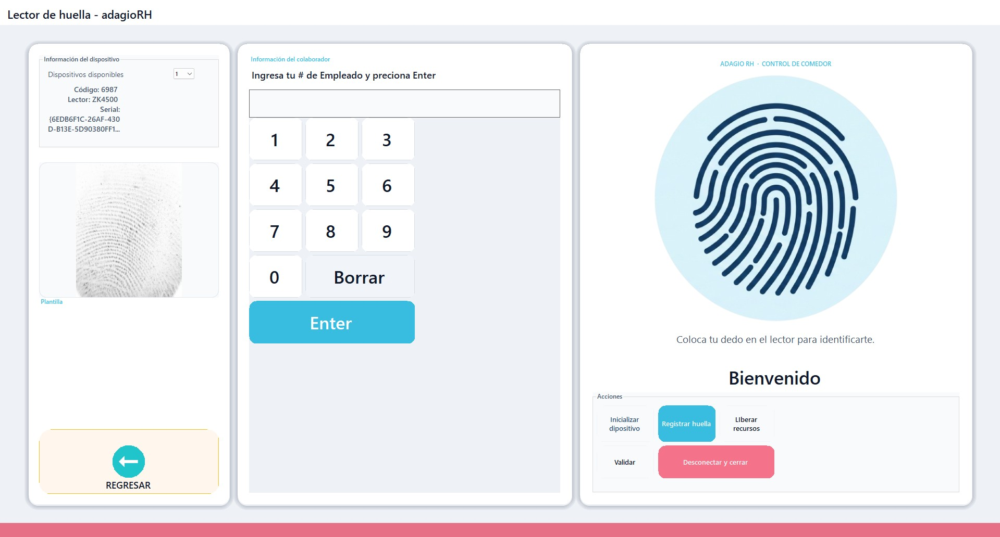
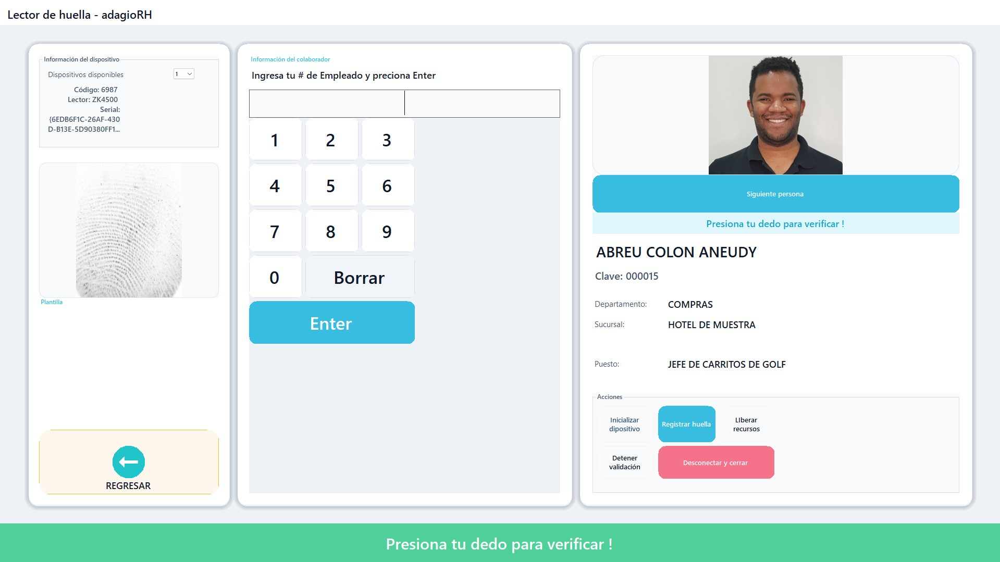
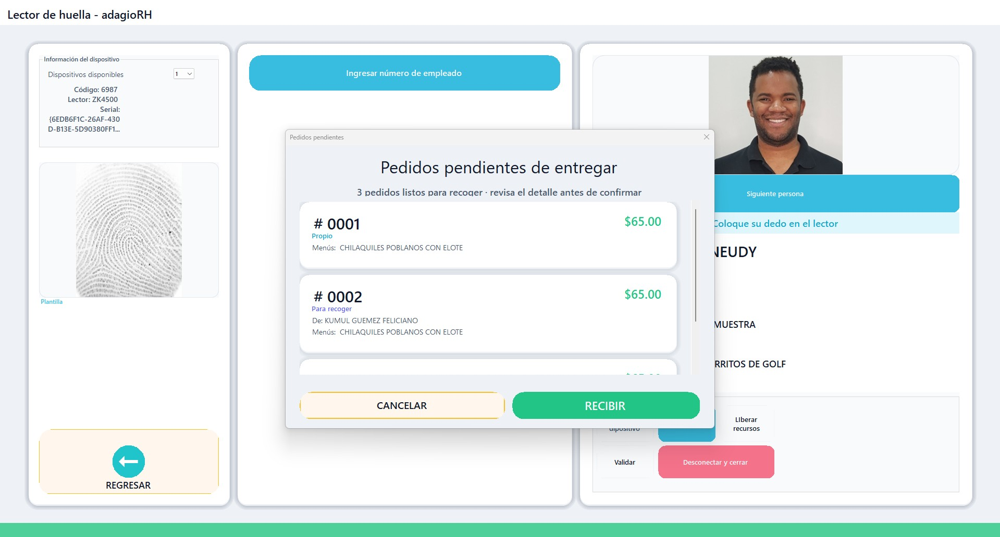

# Guía de usuario — Recoger pedidos en comedor (adagioRH)

Esta guía explica cómo usar el **kiosco de comedor** para que los colaboradores identifiquen su persona y recojan los pedidos que tienen asignados. El sistema reconoce primero la **huella digital**; si no es posible, permite ingresar el **número de empleado (nómina)**.

---

## Antes de empezar

| Requisito | Detalle |
|-----------|---------|
| Quién opera el login inicial | Personal autorizado (administrador del kiosco) |
| Quién usa el resto del flujo | Colaboradores que van a recoger su comida |
| Lector de huella | Debe estar conectado y encendido (por ejemplo, modelo ZK4500) |
| Número de empleado | Lo conoce el colaborador; suele ser su clave o número de nómina |

> **Importante:** Los botones de la sección **Acciones** (Registrar huella, Desconectar y cerrar, etc.) son para configuración o soporte técnico. El colaborador **no** debe usarlos durante la recogida normal.

---

## Resumen del proceso

---

## Paso 1 — Inicio de sesión (pantalla LOGIN)

El kiosco debe abrirse con la pantalla de acceso del sistema **adagio**.

### Qué hacer

1. En el campo superior, escriba el **usuario** que le proporcionó el administrador.
2. En el campo **CONTRASEÑA**, escriba la contraseña correspondiente.
3. Pulse el botón **ACCEDER**.

### Resultado esperado

- Si los datos son correctos, el sistema abre el **Lector de huella — adagioRH** (Control de comedor).
- Si aparece error de acceso, verifique usuario y contraseña con el administrador.

### Cerrar la ventana

- El icono **X** en la esquina superior derecha cierra el cuadro de login (solo si el administrador lo indica).

---

## Paso 2 — Pantalla principal: identificación con huella

Una vez dentro, el colaborador ve la pantalla principal del lector. Aquí debe **identificarse con su huella**.

### Elementos de la pantalla

| Zona | Para qué sirve |
|------|----------------|
| Panel derecho | Icono de huella e instrucción para colocar el dedo en el lector |
| Panel izquierdo | Información del lector conectado y vista de la huella capturada |
| Barra inferior | Mensajes de estado (éxito en verde, error en rojo) |

### Qué debe hacer el colaborador

1. Acérquese al kiosco.
2. Coloque el **mismo dedo** que registró en el sistema sobre el lector de huellas.
3. Mantenga el dedo quieto un momento hasta que el sistema responda.
4. **No** pulse botones de administración en la sección **Acciones**.

### Mensaje habitual

En el panel derecho verá algo como:

> **Coloca tu dedo en el lector para identificarte.**

### Identificación alternativa (solo si se le indica)

Si el personal de soporte lo indica, puede usar el botón **Ingresar número de empleado** del panel central. En el flujo normal, primero se intenta siempre la huella.

---

## Paso 3 — Identificado con huella, pero sin pedidos

Si la huella es **correcta** y el colaborador **no tiene pedidos** pendientes de recoger, aparece un aviso.

### Qué verá

- Ventana **Sin pedidos** con el mensaje: *No tienes pedidos por recoger.*
- Su **foto y datos** en el panel derecho (nombre, departamento, sucursal, puesto).
- Barra verde inferior: *Identificación exitosa* (con puntaje de coincidencia).

### Qué hacer

1. Lea el mensaje.
2. Espere el conteo automático (*La siguiente persona puede identificarse en X segundos*).
3. Retírese del kiosco para que la **siguiente persona** pueda identificarse.

No es necesario pulsar ningún botón para “recibir” pedidos en este caso, porque no hay nada que entregar.

---

## Paso 4 — Huella no reconocida (hasta 3 intentos)

Si el sistema **no encuentra** la huella, muestra un mensaje de error y permite **reintentar**.

### Qué verá

- Barra **roja** en la parte inferior, por ejemplo:  
  *Huella no reconocida. Intente nuevamente (2 intentos restantes).*
- En el panel izquierdo, la imagen de la última huella escaneada (**Plantilla**).

### Qué hacer el colaborador

1. Retire el dedo y vuelva a colocarlo **limpio y seco**, centrado en el lector.
2. Use el **mismo dedo** registrado en el sistema.
3. Repita hasta un máximo de **3 intentos** en total.

### Después del tercer intento fallido

El sistema deja de insistir solo con huella y pasa al **Paso 5** (número de empleado).

---

## Paso 5 — Ingresar número de nómina (validación directa)

Tras agotar los 3 intentos de huella (o cuando el sistema lo solicite), debe ingresar su **número de empleado**.

### Qué verá

- Panel central: **Ingresa tu # de Empleado y presiona Enter**
- Teclado numérico en pantalla (0–9, **Borrar**, **Enter**)

### Qué hacer

1. Toque cada dígito de su **número de empleado / nómina** en el teclado.
2. Si se equivoca, pulse **Borrar** y corrija.
3. Pulse **Enter** para validar.

### Consejos

- El número suele coincidir con su **clave de empleado** en el sistema (por ejemplo, `000015`).
- No comparta su número con otras personas; solo sirve para confirmar su identidad en este kiosco.

---

## Paso 6 — Número de empleado validado correctamente

Si el número es **válido**, el sistema muestra los datos del colaborador.

### Qué verá

- Su **fotografía** y nombre completo.
- **Clave**, departamento, sucursal y puesto.
- Barra verde o mensaje de confirmación en la parte inferior.
- El número ingresado visible en el panel central (ejemplo: `000015`).

### Qué hacer

1. Verifique que su **nombre y foto** sean los suyos.
2. Si todo es correcto, el sistema continuará automáticamente hacia la consulta de pedidos (Paso 7).
3. Si los datos **no** son suyos, avise al personal del comedor **sin** confirmar ningún pedido.

> En algunos casos el sistema puede pedir **verificar nuevamente con el dedo** después del número. Si aparece *Presiona tu dedo para verificar*, coloque la huella como en el Paso 2.

---

## Paso 7 — Pedidos listos para recoger (confirmar con RECIBIR)

Cuando la identificación fue correcta (por **huella** o por **número de empleado**) y sí tiene pedidos asignados, se muestra el detalle.

### Qué verá

- Ventana **Pedidos pendientes de entregar**.
- Cantidad de pedidos listos (ejemplo: *3 pedidos listos para recoger*).
- Cada pedido con:
  - **Número de pedido** (ej. #0001, #0002)
  - **Platillo** y precio
  - Tipo **Propio** (su pedido) o **Para recoger** (pedido de otro colaborador que usted recoge)

### Qué debe hacer (obligatorio)

1. **Revise** cada pedido del listado antes de confirmar.
2. Pulse el botón verde **RECIBIR** para terminar el proceso y registrar que ya recogió los pedidos.

### Botón CANCELAR

- Use **CANCELAR** solo si **no** va a recoger los pedidos mostrados o necesita que personal del comedor revise el caso.

### Al terminar

- El sistema registra la entrega.
- La siguiente persona ya puede identificarse en el kiosco (manualmente con **Siguiente persona** si el personal lo usa, o esperando el reinicio automático).

---

## Tabla rápida de referencia

| Paso | Pantalla | Acción del colaborador |
|------|----------|------------------------|
| 1 | Login | Administrador: usuario, contraseña, **ACCEDER** |
| 2 | Principal | Colocar **huella** en el lector |
| 3 | Sin pedidos | Leer aviso y ceder el turno |
| 4 | Error de huella | Reintentar (máx. **3** veces) |
| 5 | Teclado | Ingresar **# de empleado** + **Enter** |
| 6 | Perfil | Confirmar que sus datos son correctos |
| 7 | Pedidos | Revisar lista y pulsar **RECIBIR** |

---

## Mensajes frecuentes y qué significan

| Mensaje | Significado | Qué hacer |
|---------|-------------|-----------|
| Identificación exitosa. Puntaje: XX | Huella reconocida | Esperar pedidos o aviso de “sin pedidos” |
| Huella no reconocida… (N intentos restantes) | Huella no coincide | Reintentar; limpiar dedo y lector |
| No tienes pedidos por recoger | No hay entregas pendientes | Retirarse; pasará la siguiente persona |
| Presiona tu dedo para verificar | Verificación adicional | Colocar huella de nuevo |
| 3 pedidos listos para recoger | Hay entregas pendientes | Revisar y pulsar **RECIBIR** |

---

## Problemas comunes

### El lector no responde

- Verifique que el cable esté conectado.
- Pida al administrador que use **Inicializar dispositivo** (solo personal autorizado).

### La huella falla siempre

- Seque el dedo y limpie el sensor.
- Use el **número de empleado** después de los 3 intentos (Pasos 5 y 6).

### Aparece otro nombre o foto

- **No** pulse **RECIBIR**.
- Avise de inmediato al personal del comedor.

### No aparecen pedidos que sí encargó

- Confirme que está en el **horario y sucursal** correctos.
- Solicite apoyo al administrador del comedor con su número de empleado.

---

## Buenas prácticas en el kiosco

1. **Una persona a la vez** frente al lector.
2. Retirarse después de **RECIBIR** o del mensaje de **sin pedidos**.
3. No tocar botones rojos ni opciones de **Desconectar y cerrar**.
4. Reportar al comedor cualquier dato incorrecto antes de confirmar.

---

## Contacto y soporte

Si el kiosco no identifica, no muestra pedidos o se cierra inesperadamente, contacte al **administrador del comedor** o al área de **Recursos Humanos / sistemas** de su empresa.

---

*Documento de uso final — adagioRH Control de comedor. Actualice las capturas (1.jpg–7.jpg) si la interfaz cambia en su instalación.*
